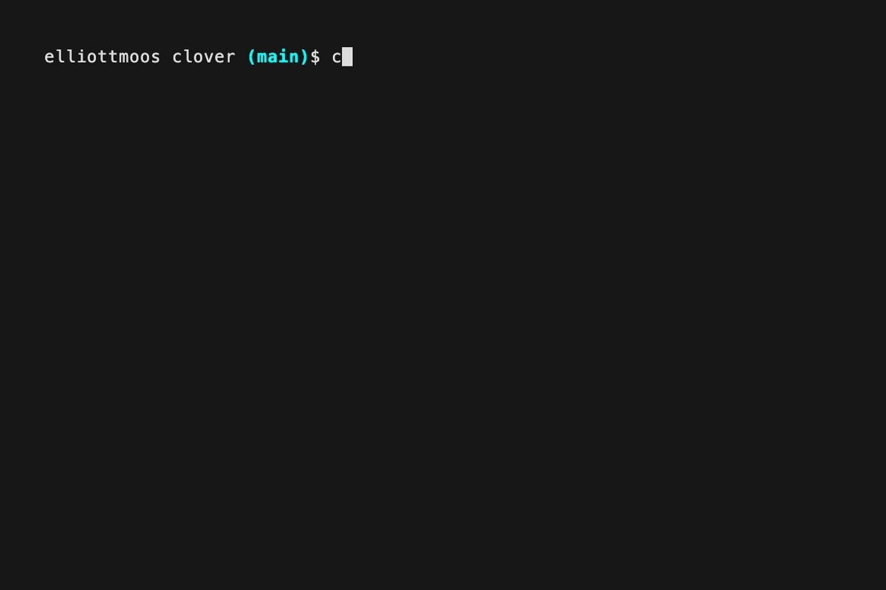

# Clover

Clover is a CLI for managing [Claude Code](https://docs.anthropic.com/en/docs/claude-code) across multiple local git repositories. Register your repos, configure Claude flags once, and launch single instances or full tmux sessions with one command.

<p align="center">
  
</p>

## Getting Started

### Prerequisites

- [Go](https://go.dev/) 1.21+
- [Claude Code](https://docs.anthropic.com/en/docs/claude-code) installed and available in `$PATH`
- [tmux](https://github.com/tmux/tmux) (required only for `clover session`)

### Install

```bash
go install github.com/elliottmoos/clover@latest
```

Or build from source:

```bash
git clone https://github.com/elliottmoos/clover.git
cd clover
make build
# binary is at ./clover
```

### Quick Start

```bash
# Register some repos
clover add ~/code/api-server
clover add ~/code/frontend --name web

# Mark repos you're actively working on
clover focus api-server
clover focus web

# Set your preferred Claude model
clover config init
clover config set claude.model opus

# Launch Claude in a single repo
clover launch api-server

# Or spin up a tmux session with all focused repos
clover session --focus
```

### Configuration

Clover uses a layered config system. Settings are merged in this order (highest priority wins):

```
CLI flags > per-repo .clover.yaml > global ~/.config/clover/config.yaml > built-in defaults
```

Create a `.clover.yaml` in any repo root to set per-repo overrides:

```yaml
claude:
  model: haiku
  additional_flags:
    - "--verbose"
```

## Command Reference

### `clover add <path>`

Register a git repository.

| Flag | Description |
|---|---|
| `-n, --name <name>` | Override the repo name (defaults to directory basename) |

### `clover remove <name>`

Unregister a repository. Prompts for confirmation unless `--force` is used.

| Flag | Description |
|---|---|
| `-f, --force` | Skip confirmation prompt |

### `clover list`

List registered repositories. Focused repos are sorted first.

| Flag | Description |
|---|---|
| `--focus` | Show only focused repositories |
| `--format <table\|json>` | Output format (default: `table`) |

### `clover focus <name>`

Toggle focus status on a repository.

### `clover launch <name>`

Launch Claude Code in a registered repo. Replaces the current process with `claude`.

| Flag | Description |
|---|---|
| `-m, --model <model>` | Override the Claude model |
| `-p, --print` | Use Claude's `--print` mode |
| `-c, --continue` | Continue the previous conversation |
| `--flag <flag>` | Pass additional flags to Claude (repeatable) |

### `clover session [names...]`

Create or reconcile a tmux session with Claude Code running in multiple repos. If the session already exists (windows layout only), missing windows are added and any window with fewer panes than desired has the missing panes filled in — existing windows are never touched.

| Flag | Description |
|---|---|
| `--focus` | Include only focused repos |
| `--all` | Include all registered repos |
| `--layout <windows\|panes>` | Tmux layout (default: from config) |
| `--name <name>` | Tmux session name (default: from config) |
| `--instances <n>` | Number of Claude panes per window, overrides config (windows layout only) |
| `--dry-run` | Print tmux commands without executing |

### `clover config init`

Scaffold a default global config at `~/.config/clover/config.yaml`.

### `clover config show`

Print the merged configuration.

| Flag | Description |
|---|---|
| `--repo <name>` | Include a specific repo's `.clover.yaml` in the merge |

### `clover config set <key> <value>`

Set a value in the global config. Supported keys:

| Key | Values |
|---|---|
| `claude.model` | Any Claude model name |
| `claude.print` | `true` / `false` |
| `claude.continue` | `true` / `false` |
| `claude.additional_flags` | Comma-separated flags |
| `session.layout` | `windows` / `panes` |
| `session.session_name` | Any string |
| `session.instances` | Number of Claude panes per window (default: `1`, max: `session.max_instances`) |
| `session.max_instances` | Upper bound for `session.instances` (default: `10`) |

### `clover config get <key>`

Get a config value. Accepts the same keys as `config set`.

### `clover version`

Print version, commit, and build date.

### `clover completion <bash|zsh|fish|powershell>`

Generate a shell completion script. For example:

```bash
# bash
clover completion bash > /etc/bash_completion.d/clover

# zsh
clover completion zsh > "${fpath[1]}/_clover"

# fish
clover completion fish > ~/.config/fish/completions/clover.fish
```
